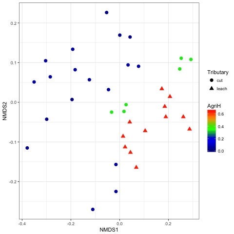

# WESIC Singapore Metagenomics Tutorial

1. [Soil profiling](#soil)

2. [Thames taxonomic profiling](#thames)

3. [Thames multivariate stats](#multi)

4. [Thames assembly based analysis](#assembly)


## Soil profiling


## Thames taxonomic profiling
<a name="thames"/>

We will start by taxonomically profiling the Thames reads with Kraken. We will use forward reads only:

```
mkdir ~/Projects/Thames
cd ~/Projects/Thames
ln -s ~/Data/Thames/Reads .
```

Run Kraken on all samples:
```
mkdir Kraken
for file in Reads/*R1*fastq
do
    base=${file##*/}
    stub=${base%_R1.fastq}
    echo $stub
    kraken --db ~/Databases/minikraken_20141208/ --threads 8 --preload --output Kraken/${stub}.kraken $file
done
```

We match against the 'minikraken' database which corresponds to RefSeq 2014.
Would we expect the profile to differ between R1 and R2?

Look at percentage of reads classified. Sediments are under studied communities!

Discussion point what can we do about under representation in Database?

The output is just a text file:

```
head Kraken/p5_A01_Sub.kraken
```

And we can generate a report:

```
kraken-report --db ~/Databases/minikraken_20141208/ Kraken/p5_A01_Sub.kraken >  Kraken/p5_A01_Sub.kraken.report
```

Some people prefer a different format:
```
kraken-mpa-report --db ~/Databases/minikraken_20141208/ Kraken/p5_A01_Sub.kraken > Kraken/p5_A01_Sub.kraken.mpa.report
```

We can get a report of the predicted genera:
```
cat  Kraken/p5_A01_Sub.kraken | awk '$4=="G"'
```

What is awk?

Now lets get reports on all samples:
```
for file in Kraken/*.kraken
do
    stub=${file%.kraken}
    echo $stub
    kraken-report --db ~/Databases/minikraken_20141208/ $file >  ${stub}.kraken.report
done
```

Having done this we want to get one table of annotations at the genera level for community comparisons:

```
for file in Kraken/*.kraken.report
do
    stub=${file%.kraken.report}
    cat  $file | awk '$4=="G"' > $stub.genera
done
```

And then run associated script:
```
CollateK.pl Kraken > GeneraKraken.csv
```

## Thames multivariate stats

<a name="multi"/>

Now we are going to use R to explore the community structure in relation to the meta data for these samples:
```
cp ~/Data/Thames/metaS.csv .
```

Start R this can be done locally after copying the "GeneraKraken.csv" and "metaS.csv" files onto your computers or on the server.
```
R
```

Now we enter commands in R to make this clear this will be preceded by the R prompt ">":
```
>GeneraKraken <- read.csv("../KrakenSub/GeneraKraken.csv",header=TRUE,row.names=1)
>GeneraKraken <- t(GeneraKraken)
>rownames(GeneraKraken) <- gsub("_Sub","",rownames(GeneraKraken))
>GeneraKrakenP <- GeneraKraken/rowSums(GeneraKraken)
```
These commands read in the genera frequency and manipulate the results to get proportions with correctly formatted sample names.

Then we read in meta data and sort rows to the same order as the genera frequencies:
```
>metaS <- read.csv('metaS.csv',header=TRUE,row.names=1)
>metaS <- metaS[row.names(GeneraKrakenP),]
```

There are seven variables in meta data table but site is just location of the sample:
```
>colnames(metaS)
```

Now we want to which meta data variables are most important for community structure we explore this with permutation ANOVA:
```
>adonis(GeneraKrakenP ~ metaS$Season)
```
This tells us how important seasonal changes are, what variable has the most impact?

A convenient way to visualise multivariate data is with an NMDS plot from the vegan package:
```
>library(vegan)
>GeneraP.nmds <- metaMDS(GeneraKrakenP)
```

```
>nmds_df<-scores(GeneraP.nmds,display=c("sites"))
```

```
>library(RColorBrewer)
>library(ggplot2)
>crp2 <- colorRampPalette(c("darkblue","blue","green","orange","red"))
>sc <- scale_colour_gradientn(colours = crp2(100), limits=c(0, 0.7))
```

```
meta_nmds.df <- cbind.data.frame(nmds_df,metaS)
```

```
>p<-ggplot(data=meta_nmds.df,aes(NMDS1,NMDS2,colour=AgriH,shape=Tributary)) + geom_point(size=3) + sc + theme_bw()
```

```
>pdf("NMDS.pdf")
>plot(p)
>dev.off()
```

 

## Thames assembly based analysis

<a name="assembly"/>


